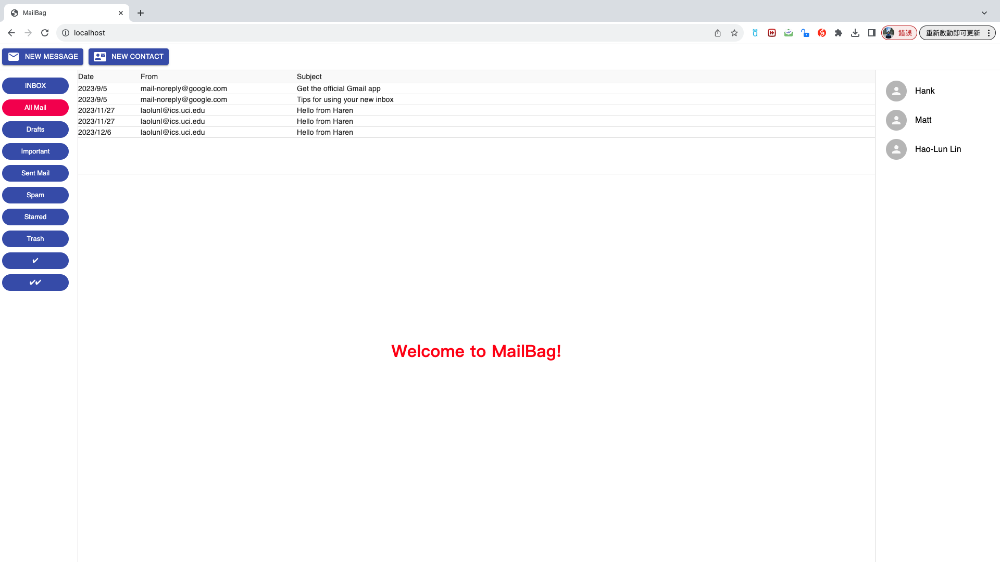

## Objective
Read, reproduce line-by-line, execute, and understand the code of Chapter 9 of the textbook. The aim here is for you to merge together different tools and techniques that you have seen in the previous assignments and readings to build a fully functional web application, in this case, the client-side component of your own webmail system! You can be creative here and if you wish you can modify and write a new code to provide a different user experience for email than it is provided by normal webmail systems! Who knows, this can even become a kickoff idea of your own startup!

From Chapter 9 of the textbook, make sure to reproduce all the codes and modify them at will adding whatever exclusive features you feel that would improve your webmail system. Make sure to profit from the knowledge that you acquired since the first module of this course to improve the user experience of your web application.

## Environment
0. The version of Node.js: v20.9.0
1. The version of React: 18.2.0
2. The version of TypeScript: 5.3.2
3. The version of Webpack: 5.73.0
4. The browser used to test: Google Chrome
5. Browser version: 118.0.5993.117 (arm64)
6. Operating system: macOS 13.5.1 (22G90)
7. Computer architecture: Apple M1 CPU with 8.0 GB RAM


## Description

I modified the [mailbag sample code](https://github.com/Apress/modern-full-stack-development/tree/master/mailbag) from the textbook [Modern Full-Stack Development: Using TypeScript, React, Node.js, Webpack, and Docker](https://www.amazon.com/Modern-Full-Stack-Development-TypeScript-Node-js/dp/1484257375), in order to make it compatible with Gmail IMAP and SMTP.

For the Gmail IMAP user, we could find that when we click on the ```Sent Mail``` or ```Draft``` or all other buttons which is not ```INBOX```, it would generate errors and block the mail website. This is because in our ```axios.get(`${config.serverAddress}/mailboxes/${inMailbox}`)```, the ```inMailbox``` can only be a single one word; if we have multiple ``/``s, it cannot redirect to the expected paths. Here, I just change the mailbox path, if the has a subfolder directory, I simply modified it into one word vocabulary for the ```IMAP Worker``` in the ```IMAP.ts``` from the client side, to make it successfully runnable.

```TypeScript
if( inMailbox === "INBOX" ){
    // do nothing
} else if ( inMailbox === "[Gmail]" ) {
    inMailbox = "Gmail";
} else if ( inMailbox === "[Gmail]/All Mail" ) {
    inMailbox = "AllMail";
} else if ( inMailbox === "[Gmail]/Drafts" ) {
    inMailbox = "Drafts";
} else if ( inMailbox === "[Gmail]/Important" ) {
    inMailbox = "Important";
} else if ( inMailbox === "[Gmail]/Sent Mail" ) {
    inMailbox = "SentMail";
} else if ( inMailbox === "[Gmail]/Spam" ) {
    inMailbox = "Spam";
} else if ( inMailbox === "[Gmail]/Starred" ) {
    inMailbox = "Starred";
} else if ( inMailbox === "[Gmail]/Trash" ) {
    inMailbox = "Trash";
} else { 
    // do nothing
}
```

Note that since we change the request messages on the client side, we also need to change the corresponding message on the server side. When we get the messages, we should change back path to the original valid one, inside the server's ```main.ts```.
```TypeScript
if( inRequest.params.mailbox === "INBOX" ){
    // do nothing
} else if ( inRequest.params.mailbox === "Gmail" ) {
    inRequest.params.mailbox = "[Gmail]";
} else if ( inRequest.params.mailbox === "AllMail" ) {
    inRequest.params.mailbox = "[Gmail]/All Mail";
} else if ( inRequest.params.mailbox === "Drafts" ) {
    inRequest.params.mailbox = "[Gmail]/Drafts";
} else if ( inRequest.params.mailbox === "Important" ) {
    inRequest.params.mailbox = "[Gmail]/Important";
} else if ( inRequest.params.mailbox === "SentMail" ) {
    inRequest.params.mailbox = "[Gmail]/Sent Mail";
} else if ( inRequest.params.mailbox === "Spam" ) {
    inRequest.params.mailbox = "[Gmail]/Spam";
} else if ( inRequest.params.mailbox === "Starred" ) {
    inRequest.params.mailbox = "[Gmail]/Starred";
} else if ( inRequest.params.mailbox === "Trash" ) {
    inRequest.params.mailbox = "[Gmail]/Trash";
} else { 
    // do nothing
}
```
      


## How AJAX Help Web Application
AJAX, or Asynchronous JavaScript and XML, revolutionizes web development for book management applications in several ways:

1. **Asynchronous Communication:** AJAX facilitates sending and receiving data from the server without reloading the entire page, providing smoother user interactions.

2. **Improved Performance:** By handling data asynchronously, AJAX minimizes page reloads, resulting in faster interactions, reduced bandwidth usage, and improved overall performance.

3. **Dynamic Content Updating:** Dynamically updating content on the page, such as adding a new book, is seamless with AJAX, eliminating the need for page refreshes.

4. **Enhanced User Experience:** AJAX creates a more interactive and seamless user experience, allowing actions like form submissions and book searches without disrupting the workflow.

5. **Support for Asynchronous Requests:** AJAX supports various asynchronous HTTP requests (GET, POST, PUT, DELETE), enabling flexible interactions with the server to retrieve or manipulate data without UI blockage.

6. **Error Handling and Feedback:** AJAX enhances error handling, enabling graceful management of server responses and the display of specific messages or notifications without disrupting the user experience.

In summary, AJAX significantly boosts the interactivity, speed, and responsiveness of book management web applications, enhancing overall user experience and functionality through asynchronous communication between the client and server.

## How to Run
0. Run the command: ```npm install``` to install all the packages we need.
1. Run the command: ```npm run build``` to build up the web client.
2. Open Google Chrome or Safari and enter ```http:127.0.0.1:80``` to access the webmail site.

## Result
### Mailbag


## Reference
1. [Modern Full-Stack Development: Using TypeScript, React, Node.js, Webpack, and Docker](https://www.amazon.com/Modern-Full-Stack-Development-TypeScript-Node-js/dp/1484257375)
2. [Textbook GitHub Repo](https://github.com/Apress/modern-full-stack-development/tree/master/mailbag)
