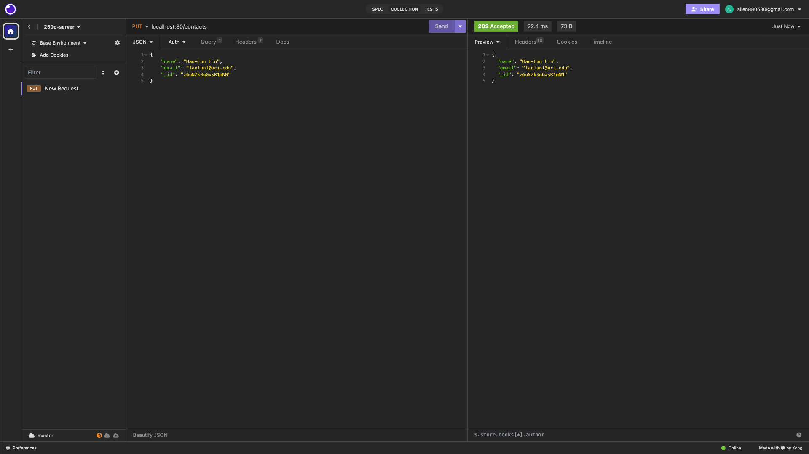

## Objective

Read, reproduce line-by-line, execute, and understand the code of Chapter 8 of the textbook. The aim here is for you to merge together different tools and techniques that you have seen in the previous assignments and readings to build a fully functional web application, in this case, the server-side component of your own webmail system!

From Chapter 8 of the textbook, make sure to reproduce all the codes and modify them at will adding whatever exclusive features you feel that would improve your webmail system.

## Environment
0. The version of Node.js: v20.9.0
1. The version of React: 18.2.0
2. The version of TypeScript: 3.6.2
3. The version of Webpack: 5.89.0
4. The browser used to test: Google Chrome
5. Browser version: 118.0.5993.117 (arm64)
6. Operating system: macOS 13.5.1 (22G90)
7. Computer architecture: Apple M1 CPU with 8.0 GB RAM


## Description
I just followed the suggested exercises listed in the textbook. (Page 216, 217)
### 0. Gmail SMTP and IMAP Setup
Follow the instruction and the information from the links ([link1](https://developers.google.com/gmail/imap/imap-smtp), [link2](https://support.google.com/mail/answer/185833?hl=en)), we could successfully set up our SMTP and IMAP account information inside the ```serverInfo.json```. 

### 1. Update Contact Information
Add an ``updateContact()`` function using the PUT method to be able to change an existing contact. You’ll need to accept the potentially new name and email address, plus the existing ``_id``, and then write the NeDB code to update it.

### 2. Set HTTP Responce Codes
Set HTTP response codes according to the discussion in the section on REST rather than using 200 for everything. This will give you some experience working with Express and some practice using Postman, Insomnia, or curl to test your changes.

#### HTTP status responses:
- ``200 OK``: 
This response code indicates a successful operation. Usually, this would be used when you DELETE a resource or PUT changes to a resource.
- ``201 CREATED``: 
This response code is frequently used for POST creation of a new resource.
- ``400 BAD REQUEST``: 
This response code is usually used to indicate that the data format sent when PUT updating or POST creating a resource was invalid or malformed in some way (500 is frequently used instead of 400).
- ``401 UNAUTHORIZED``: 
This response code is used to indicate that you need to authenticate before performing the requested operation.
- ``405 METHOD NOT ALLOWED``: 
This response code is used when the requested HTTP method isn’t supported (e.g., perhaps in a read-only interface, you wouldn’t support POST or PUT, and 500 is frequently used instead of this).
- ``500 INTERNAL SERVER ERROR``: 
This response code is generally used when some sort of error occurs that is not covered by the previous scenarios.

## How REST Help Web Application
REST, short for Representational State Transfer, serves as a design framework widely employed in web applications to streamline communication among diverse systems or components. When applied to a web application dedicated to book management, REST yields numerous advantages for the system:
1. **Uniform Interface:** Standardized interactions between clients and servers simplify communication using HTTP methods like GET, POST, PUT, and DELETE.
2. **Scalability and Performance:** Each request in REST contains all necessary information, and the statelessness in RESTful APIs eliminates the need for the server to retain client state, enhancing scalability and improving response times.
3. **Flexibility and Modularity:** RESTful APIs allow a modular design, enabling independent development and scaling of different application components.
4. **Interoperability:** Standard protocols like HTTP and simple data formats such as JSON or XML facilitate seamless communication between systems.
5. **Caching:** RESTful APIs utilize HTTP caching mechanisms, reducing server load and optimizing performance by serving cached data when appropriate.

## How to Run
0. Run the command: ```npm install``` to install all the package we need.
1. Modify the SMTP and IMAP setting inside the ```serverInfo.json``` to set up your Gmail account access. ([Helpful link](https://support.google.com/mail/answer/185833?hl=en))
2. Run the command: ```npm run compile``` to activate the mailbag server.
3. Download the [```Insomnia```](https://app.insomnia.rest/), which is the best API Client for REST, GraphQL, GRPC and OpenAPI design tool for developers.
4. Open the ```Insomnia``` app and create the document for testing the functionality of our web mailbag server.
5. Connect to our web mailbag server on ```localhost:80``` and then we can do whatever we want to check all the functions we defined.

## Result
### Get the contacts

### Update the contacts

### Check the updated contacts


## Reference
1. [Modern Full-Stack Development: Using TypeScript, React, Node.js, Webpack, and Docker](https://www.amazon.com/Modern-Full-Stack-Development-TypeScript-Node-js/dp/1484257375)
2. [Textbook GitHub Repo](https://github.com/Apress/modern-full-stack-development/tree/master/mailbag)