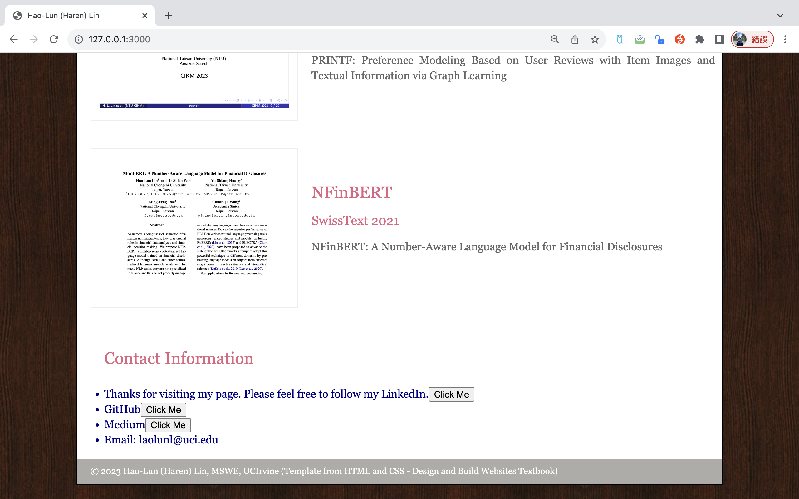

## Objective
Add some React components to your webpage based on the codes from Chapters 3 and 4 of the textbook. The aim is for you to get acquainted with React and how React can be used to improve significantly the user experience in more complex web applications - as you will be developing later in this course.

Using the relevant partial codes from Chapter 3 and 4 of the textbook, either modify the web page that you developed in the first assignment so you can add React components or create a new web page from scratch to demonstrate your React understanding.

## Environment
0. The version of Node.js: v20.9.0
1. The browser used to test: Google Chrome
2. Browser version: 118.0.5993.117 (arm64)
3. Operating system: macOS 13.5.1 (22G90)
4. Computer architecture: Apple M1 CPU with 8.0 GB RAM

## Description
I modified the sample code from the textbook [HTML and CSS: Design and Build Websites](https://www.amazon.com/HTML-CSS-Design-Build-Websites/dp/1118008189), and made some changes of the sections of the website in the previous assignment. Moreover, I naively develop the website with a simple Node.js server (```server.js```) using the fs (File System) module to read the content of a file and serve it as a response when a request is made to the server. 

Here, we focus on the ```React``` framework. What I have done in the homework is change the ```contact-details``` in the original ```index.html``` file, and substitute the code using ```React``` script. Specifically, I defined a ```SocialMediaBlock``` component and uses it to create a contact information section with links to social media profiles. Let me break it down:

### 0. SocialMediaBlock Component
It is a React component created using the ```class``` syntax. The constructor initializes the component's state, and in this case, it sets ```this.message``` to the value of ```this.props.platform```. The ```render``` method generates the HTML structure for the component using ```React.createElement```. It creates an ```<li>``` element containing an ```<a>``` element with the text content being ```this.message``` (which is initially set to the social media platform). Additionally, it includes a ```<button>``` element that, when clicked, opens a new window with the link provided in ```this.props.href``` and updates ```this.message```. The component then triggers a re-render by calling ```this.setState({})```.

### 1. Root Element
The ```rootElement``` is the main structure of the contact information section. It includes an ```<h2>``` element with the text ```Contact Information``` and an ```<ul>``` element containing several ```SocialMediaBlock``` components and a regular ```<li>``` element with an email link.

### 2. Rendering the Root Element
```ReactDOM.render(rootElement, document.getElementById("contact-details"));``` renders the ```rootElement``` and attaches it to the HTML element with the ID ```contact-details```. This assumes that there is an HTML element with that ID in the document where the React app should be mounted. 

### 3. Event Handling in SocialMediaBlock
When the ```Click Me``` button inside a ```SocialMediaBlock``` is clicked, it opens a new window with the URL specified in ```this.props.href```. It also updates this.message with a thank you message and triggers a re-render using ```this.setState({})```.

In summary, the code creates a simple React component (```SocialMediaBlock```) that represents a block of social media information. It then uses this component to construct a contact information section and renders it into the HTML document. The ```Click Me``` button in each social media block opens a new window and updates the displayed message.


## How to run
0. Run the command: ``` npm install ```.
1. Run the command: ``` node server.js ```
2. Open Google Chrome or Safari, type the url and enter: ``` http://127.0.0.1:3000/ ```

## Result

