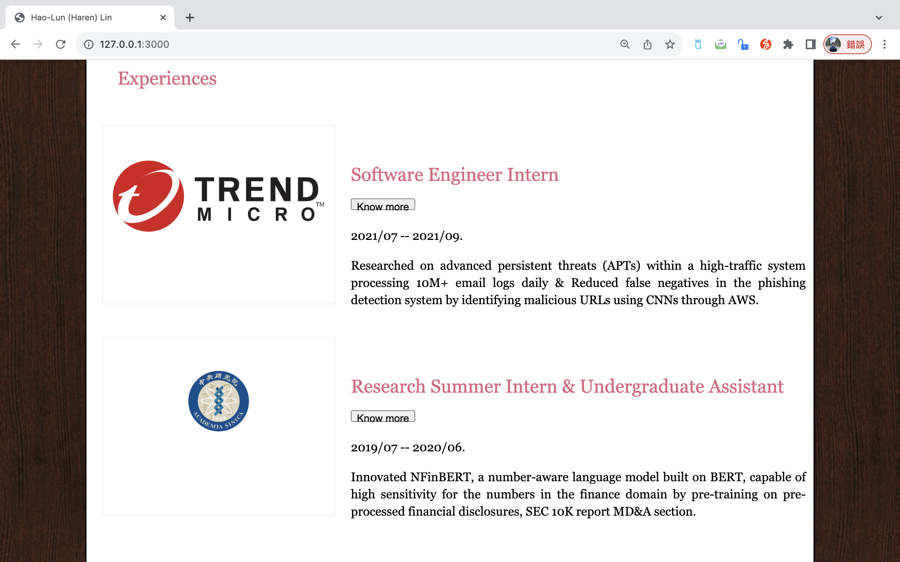

## Objective
Read, reproduce line-by-line, execute, and understand the code from Chapter 5 of the textbook. The aim is for you to learn the basics of TypeScript, which is an important modern language for web development that is becoming each time more popular in the web industry.

 

From Chapter 5 of the textbook, make sure to reproduce all the codes. Create a small webpage or modify the webpage that you have been developing throughout this course to demonstrate that you understand how to write simple TypeScript code. Your webpage can be about anything, as long as it is fully functional and that it includes TypeScript elements. Make sure to use arrow functions and some classes also.

## Environment
0. The version of Node.js: v20.9.0
1. The browser used to test: Google Chrome
2. Browser version: 118.0.5993.117 (arm64)
3. Operating system: macOS 13.5.1 (22G90)
4. Computer architecture: Apple M1 CPU with 8.0 GB RAM

## Description
I modified the sample code from the textbook [HTML and CSS: Design and Build Websites](https://www.amazon.com/HTML-CSS-Design-Build-Websites/dp/1118008189), and made some changes of the sections of the website in the previous assignment. Moreover, I naively developed the website with a simple Node.js server (```server.js```) using the fs (File System) module to read the content of a file and serve it as a response when a request is made to the server. 

Here, we focus on the ```Typescript```. I changed the codes inside the ```Experiences``` section in the ```index.html``` file, and read the ```index.js``` (which is compiled from the ```index.ts```) file to get the details of the ```Experiences``` section. 

Basically, the ```index.ts``` TypeScript code defines a class called ```InternExperience``` and uses it to create instances representing different internship experiences. It also includes a function called ```button``` that takes a company name as an argument and updates the content and style of an HTML element based on the internship information. Let's break down the code step by step:

### 0. InternExperience class
```Typescript
class InternExperience {
	date: string;
	company: string;
	description: string;

	constructor(company: string, date: string, description: string){
		this.date = date;
		this.company = company;
		this.description = description;
	}

	public getDate() {
		return this.date;
	}

	public getName() {
		return this.company;
	}

	public getDescription() {
		return this.description;
	}
}
```
This class represents an internship experience with three properties: ```date```, ```company```, and ```description```. The constructor initializes these properties when an instance is created. The class also has three public methods (```getDate```, ```getName```, and ```getDescription```) to retrieve the values of these properties.

### 1. Object Creation
```Typescript
const trm = new InternExperience("trend-micro", "2021/07 -- 2021/09", "TL;DR");
const acs = new InternExperience("academia-sinica", "2019/07 -- 2020/06", "TL;DR");
```
Two instances of the InternExperience class are created: ```trm``` representing an internship at Trend Micro and ```acs``` representing an internship at Academia Sinica.

### 2. ```button``` Function
```Typescript
function button(companyName: string): void {
	const getExp = (companyName: string): InternExperience | undefined => {
		if (companyName === "trend-micro") {
			return trm;
		} else if (companyName === "academia-sinica") {
			return acs;
		}
		return undefined;
	};

	const curExp = getExp(companyName);
	const element: HTMLElement = document.getElementById(companyName) as HTMLElement;
	element.innerHTML = "<p>" + curExp.getDate() + ".</p><p>" + curExp.getDescription() + "</p>";
	element.style.color = 'black';
	element.style.fontSize = '16px';
}
```
This function takes a company name as an argument and retrieves the corresponding internship experience using the getExp function. It then updates the content and style of an HTML element with the given company name. The HTML content includes the internship date and description.

Note: The use of ```document.getElementById``` assumes that there are HTML elements with IDs corresponding to the company names ("trend-micro" and "academia-sinica"). If these elements don't exist, it could lead to errors. Also, using ```document.write``` is typically discouraged in modern web development. It's better to manipulate the DOM directly, as done in this code.


## How to run
0. Run the command: ``` npm install ```.
1. Compile the Typescript code using the command: ```tsc index.ts``` and get the ```idnex.js``` file.
2. Run the command: ```node server.js```
3. Open Google Chrome or Safari, type the url and enter: ``` http://127.0.0.1:3000/ ```

## Result

