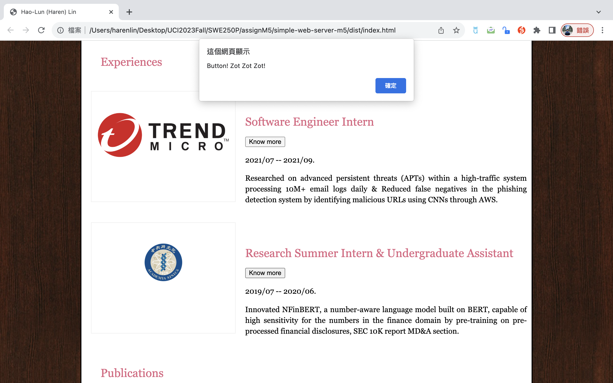

## Objective
Read, reproduce line-by-line, execute, and understand the code from Chapter 6 and 7 of the textbook. The aim is for you to learn more advanced features of TypeScript and learn how to create bundles that simplify the management of the development and deployment of your web applications.

From Chapter 6 of the textbook, make sure to reproduce all the codes. Add some mode advanced features of TypeScript to the webpage that you have been working in the previous assignment. You should at least demonstrate that you can work with modules, but if you wish you can also start using third party libraries.

From Chapter 7 of the textbook, make sure you understand how to use Webpack and apply it to create a basic project.

## Environment
0. The version of Node.js: v20.9.0
1. The version of Webpack: 5.89.0 
2. The browser used to test: Google Chrome
3. Browser version: 118.0.5993.117 (arm64)
4. Operating system: macOS 13.5.1 (22G90)
5. Computer architecture: Apple M1 CPU with 8.0 GB RAM

## Description
I modified the sample code from the textbook [HTML and CSS: Design and Build Websites](https://www.amazon.com/HTML-CSS-Design-Build-Websites/dp/1118008189), and made some changes of the sections of the website in the previous assignment. Moreover, I naively developed the website with a simple Node.js server (```server.js```) using the fs (File System) module to read the content of a file and serve it as a response when a request is made to the server. 

Here, we focus on the ```Webpack```. All I do right here is to split the ```index.ts``` file from the previous assignment into 2 different ```ts``` files in order to make it modulized. The ```InternExperience``` class definition and the object instance creation are located in the ```myModule.ts```. The ```button``` function is then defined inside the ```app.ts```. and then import the class and the objects for response of the button click. At last, I wrap the codes together into the ```entry.ts``` file, and use ```Webpack``` to compile it, in order to integrate multiple ```ts``` files together and generate only one ```index.html```.

There are 2 things I would like to talk more inside ```app.ts```:
### 0. Global Declaration
```Typescript
const globalAny: any = global;
```
This line is declaring a constant named ```globalAny``` and assigning the global object to it. The ```any``` type is used here because the global object may have various properties and methods, and TypeScript doesn't have complete type information for it.

### 1. Global Assignment:
```Typescript
globalAny.document.button = button;
```
This line adds the ```button``` function to the ```document``` object in the global scope. It allows the ```button``` function to be accessed globally from other parts of the application.

## The TypeScript Features Used 
- Type Annotation
- Class Definition with Constructor
- Arrow Function (e.g. ```const FuncName = (args: types) : returnTypes => {...}```)
- DOM Manipulation (e.g. ```document.getElementById(...)```)
- Type Assertion (e.g. ```HTMLElement```)
- Modules

## How to Debug
1. TypeScript Compiler (```tsc```):
   Compile the TypeScript code with debugging information enabled using the TypeScript Compiler with the `--sourceMap` option. This generates source maps that establish a connection between the generated JavaScript code and the original TypeScript code. This linkage greatly facilitates debugging efforts.

2. IDE Debugging Tools:
   Take advantage of the debugging capabilities provided by Integrated Development Environments (IDEs) such as Visual Studio Code. These tools allow developers to set breakpoints, inspect variable values, and step through code execution, providing a powerful and interactive debugging experience.

3. Console Logging:
   strategically insert `console.log` statements at key points in the code. These statements can be used to log variable values, function outputs, or specific milestones in the code execution. This practice helps in understanding the flow of the program and provides insights into the values of variables during runtime.

P.S. If all of above don't work, ask questions on [StackOverflow](https://stackoverflow.com/).


## How to run
0. Run the command: ``` npm install ```.
1. Compile the Typescript code using the command: ```tsc *.ts``` and get the multiple ```js``` files.
2. Run the command: ```npx webpack```, to generate the single ```main.js``` file and ```index.html``` file.
3. Open the ```index.html``` file on Google Chrome or Safari.


## Result

